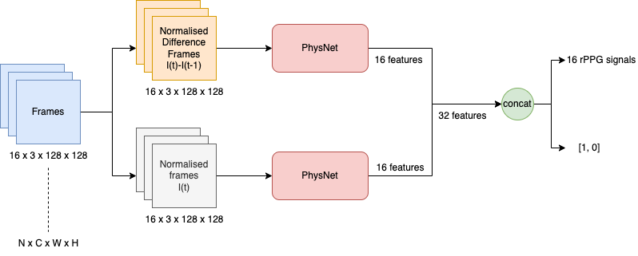

# :wave: Introduction

**Deep Fake Detection** This research project explores PhysNet as a backbone and rPPG biomarkers also known as remote photoplethysmography(rPPG) for deepfake detection. 



Comparisons benchmarks with **existing state-of-the-art networks** are make and as well as the training of the network and testing ability.

# :file_folder: Datasets
The toolbox supports five deepfake datasets part of FF++ dataset namely Neural Textures, Face2Face, FaceSwap, FaceShifter, Deepfakes, and DeepFake Detection. Our network was trained with Neural Textures and paired real videos and tested with Face2Face. **To use these datasets in a deep learning network, download the FF++ dataset from the original repository below and the train/val/test json files for splitting the data and organize the files as follows.** This will give you the videos. Follow the below preprocessing steps below to create the frames, landmarks and split text files.
* [FF++](https://github.com/ondyari/FaceForensics/blob/master/dataset/README.md)
    * A. Rössler, D. Cozzolino, L. Verdoliva, C. Riess, J. Thies, and M. Nießner, “Faceforensics++: Learning to detect manipulated facial images,” CoRR, vol. abs/1901.08971, 2019. arXiv: 1901.08971. [Online]. Available: http://arxiv.org/abs/1901.08971.
    -----------------
         - notebooks/
            |-- FaceForensics++/
            |-- original_sequences/
            |   |-- youtube/
            |       |-- c23/
            |           |-- train.txt
            |           |-- val.txt
            |           |-- test.txt
            |           |-- videos/
            |                 |-- 000.mp4
            |                 |-- ...
            |                 |-- 999.mp4
            |           |-- frames/
            |                 |-- 000
            |                 |-- ...
            |                 |-- 999
            |           |-- landmarks/
            |                 |-- 000
            |                 |-- ...
            |                 |-- 999
            |-- manipulated_sequences/
            |   |-- NeuralTextures/
            |       |-- c23/
            |           |-- val.txt
            |           |-- train.txt
            |           |-- test.txt
            |           |-- videos/
            |                 |-- 000_981.mp4
            |                 |-- ...
            |                 |-- 999_098.mp4
            |           |-- frames/
            |                 |-- 000_981
            |                 |-- ...
            |                 |-- 999_098
            |           |-- landmarks/
            |                 |-- 000_981
            |                 |-- ...
            |                 |-- 999_098
            |   |-- DeepFakeDetection/
            |   |-- FaceSwap/
            |   |-- Face2Face/
            |   |-- FaceShifter/
            |-- train.json
            |-- val.json
            |-- test.json

    -----------------

# :wrench: Setup

STEP 1: `conda create --name DeepFakeDet`

STEP 2: `conda activate DeepFakeDet`

STEP 3: `pip install -r requirements.txt` 

# :fast_forward: Best Model Pretrained Weights

Please download from x

# :wrench: Preprocessing

STEP 1: go to https://github.com/SCLBD/DeepfakeBench/blob/main/README.md#3-preprocessing-optional 

STEP 2: run `python preprocess.py`

STEP 3: obtain the json train/val/test split file from FF++ (https://github.com/ondyari/FaceForensics/blob/master/dataset/README.md) and save it under the root folder (FaceForensics++)

STEP 4: run `create_split_filepaths.py` from this repository under `Utils` and provide the argument `--root file_path_to_FaceForensics++` to create the train/valid/test split text files

# :wrench: rPPG Ground Truth Labels
To obtain rPPG labels from the dataset we perform the below steps.

STEP 1: Obtain pre-trained weights `UBFC-rPPG_PhysNet_DiffNormalized.pth` from (https://github.com/ubicomplab/rPPG-Toolbox) and put them under `final_model_release`

STEP 1: Run `python main.py --config_file ./configs/infer_configs/PURE_UBFC-rPPG_PHYSNET_BASIC.yaml`

<!-- STEP 2: Run `python text_to_csv.py` -->

# :computer: Network Training and Testing

Please use config files under `./configs/train_configs`

In the `main.py` file change the paths linking to training/validation/testing splits text files on the following lines: 209, 210, 220, 224, 291, 299, 331, 332, 333

## Training on Neural Textures and Testing on Neural Textures With Multi-Model PhysNet 

STEP 1: Modify `./configs/train_configs/UBFC_FF_PHYSNET_BASIC.yaml`

STEP 2: Update `MODEL_PATH:` to `"final_model_release/UBFC-rPPG_PhysNet_DiffNormalized.pth`

STEP 3: Run `python main.py --config_file ./configs/train_configs/UBFC_FF_PHYSNET_BASIC.yaml` 

Note 1: To train a single PhysNet backbone classifier which we call DeepFakePhys, replace the model name `MultiPhysNetModel` with `PhysNet`.

Note 2: The following configs are used for training 3DResNet-18 and XceptionNet, KINETICS_FF_RESNET3D_BASIC.yaml and NOPRETRAIN_FF_XCEPTION_BASIC.yaml respectively.

## Testing on Face2Face With Multi-Model PhysNet

STEP 1: Modify `./configs/train_configs/UBFC_FF_PHYSNET_BASIC.yaml` 

STEP 2: Run `python main.py --config_file ./configs/train_configs/UBFC_FF_PHYSNET_BASIC.yaml`

Note 1: Change `train_and_test` to `only_test`

# :computer: Benchmark Training and Testing

## XceptionNet:

STEP 1: Modify `./configs/train_configs/NOPRETRAIN_FF_XCEPTION_BASIC.yaml` 

STEP 2: Run `python main.py --config_file ./configs/train_configs/NOPRETRAIN_FF_XCEPTION_BASIC.yaml` 

## 3DResNet-18:

STEP 1: Modify `./configs/train_configs/KINETICS_FF_RESNET3D_BASIC.yaml` 

STEP 2: Run `python main.py --config_file ./configs/train_configs/KINETICS_FF_RESNET3D_BASIC.yaml` 

# :scroll: YAML File Setting
Yaml files control all parameters for training and evaluation. 
You can modify the existing yaml files to meet your own training and testing requirements.

Here are some explanation of parameters:
* #### TOOLBOX_MODE: 
  * `train_and_test`: train on the dataset and use the newly trained model to test.
  * `only_test`: you need to set INFERENCE-MODEL_PATH, and it will use pre-trained model initialized with the MODEL_PATH to test.
* #### TRAIN / VALID / TEST: 
  * `MODEL_FILE_NAME`: The name of the trained model
  * `DATASET`: The folder name of the dataset for training/validation/testing.
  * `DATA_TYPE`: How to preprocess the video data
  * `LABEL_TYPE`: How to preprocess the rPPG label data
  * `CHUNK_LENGTH`: The length of each chunk (number of frames) which are changed during experimentation with different chunk sizes 
  * `NAME`: Model name to test
  
* #### MODEL : Set used model (XceptionNet, DeepFakePhys, 3D-ResNet18, Multi-Model PhysNet are supported).
* #### METRICS: Set used metrics. Example: ['AUC','Accuracy','Precision','Recall','F1-Score']

# :scroll: Citations


# Acknowledgements

[PhysNet]
```
@inproceedings{yu2019remote,
    title={Remote Photoplethysmograph Signal Measurement from Facial Videos Using Spatio-Temporal Networks},
    author={Yu, Zitong and Li, Xiaobai and Zhao, Guoying},
    booktitle= {Proc. BMVC},
    year = {2019}
}
```

[rPPG-Toolbox] 
rPPG Toolbox has been reused in this project which is why the original files feature heavily in our repository.
```
@article{liu2022rppg,
  title={rPPG-Toolbox: Deep Remote PPG Toolbox},
  author={Liu, Xin and Narayanswamy, Girish and Paruchuri, Akshay and Zhang, Xiaoyu and Tang, Jiankai and Zhang, Yuzhe and Wang, Yuntao and Sengupta, Soumyadip and Patel, Shwetak and McDuff, Daniel},
  journal={arXiv preprint arXiv:2210.00716},
  year={2022}
}
```

# Issues
I encountered challenges with Condor's interaction with Git and private GitHub repositories. As a result the commits were uploaded to GitHub at a later date rather than being pushed consistently during development. Additionally due to the experimental nature of the project, involving multiple models and the creation of new ones, maintaining an up-to-date Git repository was challenging. The objective was research-oriented rather than focused on front-end or back-end development.

Therefore, the Git commit history is limited. However, if needed, I can provide access to the Condor notebook to review the project history and images.